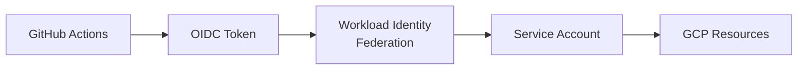

# GitHub Actions OIDC Authentication to GCP

> Updated on 2025-07-10 by @KemingHe

Terraform configuration for OpenID Connect (OIDC) authentication between GitHub Actions and Google Cloud Platform (GCP), eliminating service account JSON files.

## 🔒 Security & Architecture

### Security Features

- **Repository-scoped**: Only specified repository can authenticate
- **Short-lived tokens**: No long-lived credentials  
- **Minimal permissions**: Base setup grants only authentication rights
- **Attribute validation**: Access restricted by repository claims

### Authentication Flow



## 🚀 Setup & Usage

### Prerequisites

GCP project with billing, GitHub repo, Terraform ≥1.0, authenticated `gcloud` CLI

### Files

```plaintext
auth-gcp/
├── business.tf               # Application-specific permissions template
├── main.tf                   # Core OIDC authentication infrastructure  
├── outputs.tf                # GitHub Actions configuration values
├── providers.tf              # Terraform and Google provider setup
├── terraform.tfvars.example  # Configuration template
├── README.md                 # Documentation
└── variables.tf              # Input variables with validation
```

### Deploy

1. **Configure:** `cp terraform.tfvars.example terraform.tfvars` → Edit with your `github_repo` and `gcp_project_id`
2. **Deploy:** `terraform init && terraform plan && terraform apply`
3. **GitHub secrets** (Settings → Secrets → Actions):
   - `GCP_SERVICE_ACCOUNT`: Use output `service_account_email`
   - `GCP_WORKLOAD_IDENTITY_PROVIDER`: Use output `workload_identity_provider_name`
4. **Workflow usage:**

   ```yaml
   - name: Authenticate to GCP
     uses: 'google-github-actions/auth@v2.1.10' # Pinned to avoid supply-chain attacks
     with:
       workload_identity_provider: ${{ secrets.GCP_WORKLOAD_IDENTITY_PROVIDER }}
       service_account: ${{ secrets.GCP_SERVICE_ACCOUNT }}
   ```

5. **Cleanup:** Run `terraform destroy` to remove all resources when no longer needed

## 🔧 Customization

### Application Permissions

Add to [`business.tf`](./business.tf):

```hcl
resource "google_project_iam_member" "storage_admin" { # Example
  project = var.gcp_project_id
  role    = "roles/storage.admin"
  member  = "serviceAccount:${google_service_account.github_actions_sa.email}"
}
```

### Variables

| Variable | Description | Default | Required |
| :-- | :-- | :-- | :-: |
| `github_repo` | Repository in `owner/repo` format | N/A | ✅ |
| `gcp_project_id` | GCP project ID | N/A | ✅ |
| `service_account_id` | Service account name | `github-actions-sa` | - |
| `wif_pool_id` | Identity pool name | `github-actions-pool` | - |
| `wif_provider_id` | Identity provider name | `github-actions-provider` | - |

### Advanced

- **Multiple repos:**

  ```hcl
  # Edit main.tf attribute_condition directly for multiple repositories
  attribute_condition = "assertion.repository in ['org/repo1', 'org/repo2']"
  ```

- **Custom attribute conditions:**
  
  ```hcl
  # Edit main.tf for custom conditions such as restricting to specific users
  attribute_condition = "assertion.repository == '${var.github_repo}' && assertion.actor == 'specific-user'"
  ```

## 📚 References

- [Workload Identity Federation](https://cloud.google.com/iam/docs/workload-identity-federation)
- [GitHub OIDC](https://docs.github.com/en/actions/deployment/security-hardening-your-deployments/about-security-hardening-with-openid-connect)
- [`google-github-actions/auth`](https://github.com/google-github-actions/auth)
